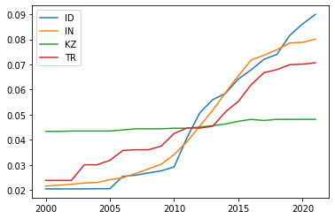
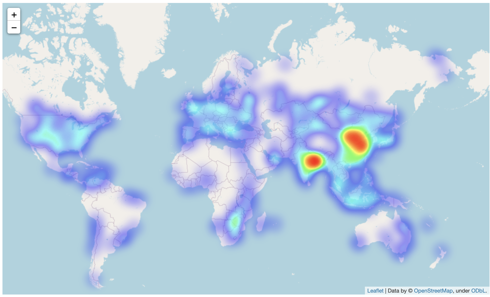

# Data Visualization Ideas for Coal Tracker Project

This is file shows the prototype of:

1. Clustering plant location on map
2. Sunburst based on subnational plant status
3. Progress Correlation of each country
4. Heatmap based on plant capacity MW

## Clustering Plant Location on Map

This idea is to cluster plants location based on a certain radius so it declutter the points on the map. An example is shown below.

<p align="center">
    
</p>

Here is a snippet of the code using folium and OpenStreetMap as the base map

```python
import folium
from folium.plugins import MarkerCluster

world_map= folium.Map(tiles="cartodbpositron")
marker_cluster = MarkerCluster().add_to(world_map)


radius=5
for i in range(len(GEM)):
        lat = GEM.iloc[i]['latitude']
        long = GEM.iloc[i]['longitude']
        popup_text = """Country : {}<br>Status : {}<br>Tracker ID : {}"""
        popup_text = popup_text.format(GEM.iloc[i]['country'],
                                   GEM.iloc[i]['status'], GEM.iloc[i]['tracker_id']
                                   )
        folium.CircleMarker(location = [lat, long], radius=radius, popup= popup_text, fill =True).add_to(marker_cluster)

world_map
```

## Sunburst Based on Subnational Plant Status

This idea is to show ratio of plant statuses for subnational level. An example is shown below.

<p align="center">
    
</p>

However, this data visualization does not work with a lot of data. Example is shown below.

<p align="center">
    
    
</p>

Here is a snippet of the code using plotly

```python
import plotly.express as px

fig = px.sunburst(ppca[ppca['Subnational unit (province, state)']=='Ohio'],
                  path=['Subnational unit (province, state)','Status','Location'])
fig.show()
```

## Progress Correlation of Each Country

This idea is to show countries progress that is closest to a selected country by using total capacity over time data. An example of it is shown below using matplotlib to visualize.



This is a snippet of the code using pandas to get the closest correlation.


```python
import pandas as pd

coal_power_generation_path ="/country_main.json"
coal_power_generation = pd.read_json(json_path+coal_power_generation_path)
coal_power_generation

countries_key = coal_power_generation['countries'].keys()
year = [i for i in range(2000,2022)]
capacity_data = []
for country in countries_key:
    temp =[]
    for capacity in coal_power_generation['countries'][country]['capacity_time_series']:
        temp.append(capacity['capacity'])
    capacity_data.append(temp)

column =['country']+year
capacity_time_series = pd.DataFrame(data, columns=column)
capacity_time_series.set_index('country')

capacity_time_series[year] =capacity_time_series[year].div(capacity_time_series[year].sum(axis=1),axis =0).fillna(float(0))
id_time_series = capacity_time_series[capacity_time_series['country']=='ID'][year].iloc[0]
correlated_to_id = [id_time_series.corr(capacity_time_series[year].iloc[i]) for i in range(capacity_time_series.shape[0])]
capacity_time_series['correlated_to_id']= correlated_to_id
capacity_time_series.sort_values(by="correlated_to_id",ascending=False)
```

## Heatmap Based on Plant Capacity MW

This idea shows the area that has the high concentration of capacity around the world. Red color means the highest and blue means the lowest capacity of plant located. An example is shown below.

<p align="center">
    
</p>

This is a sample of the code using folium and OpenStreetMap as the base map

```python
from folium.plugins import HeatMap


hmap = folium.Map(zoom_start=7 )

hm_wide = HeatMap( list(zip(gem_heatmap.latitude.values, gem_heatmap.longitude.values,gem_heatmap.capacity_mw.values)),
                   min_opacity=0.2,
                   radius=17, blur=15, 
                   max_zoom=1, 
                 )

hmap.add_child(hm_wide)
```