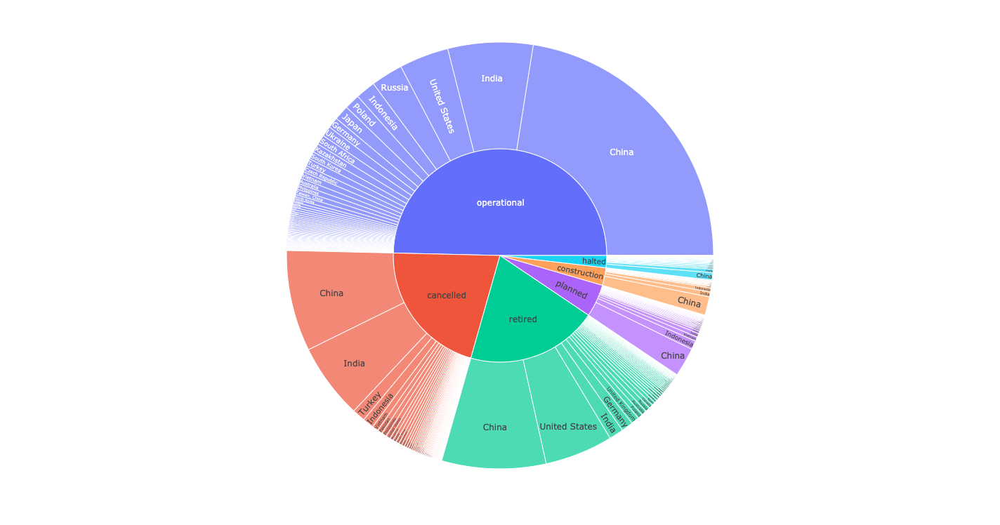

# data_viz_suggestion

This is file shows the prototype of:

1. Clustering plant location on map
2. Sunburst based on subnational plant status
3. Progress Correlation of each country
4. Heatmap based plant capacity MW

## Clustering Plant Location on Map

This idea is to cluster plants location based on a certain radius so it declutter the points on the map. An example is shown below.

## Sunburst Based on Subnational Plant Status

This idea is to show ratio of plant statuses for subnational level. An example is shown below.

    

However, this data visualization does not work with a lot of data. Example is shown below.

    
    
</p

## Progress Correlation of Each Country

This idea is to show countries progress that is closest to a selected country by using total capacity over time data. An example of it is shown below.

